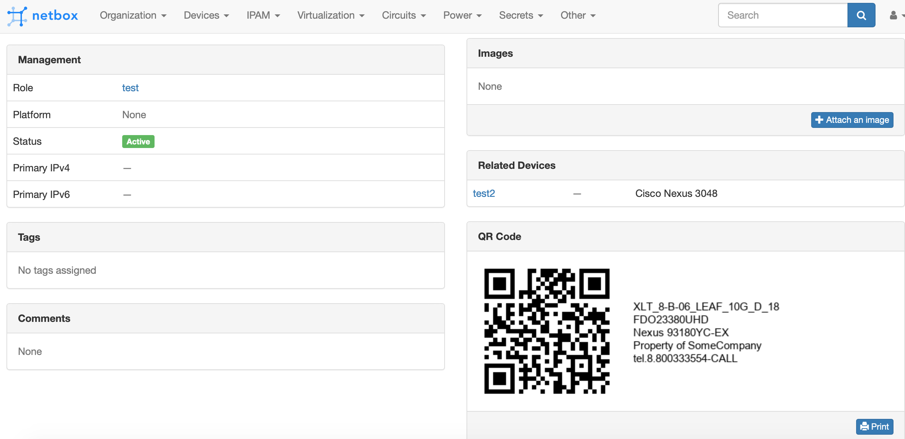
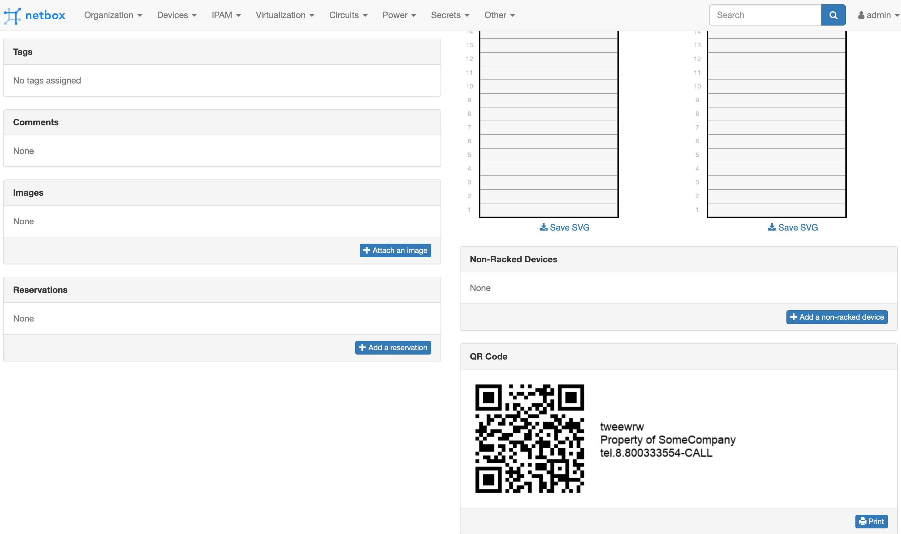
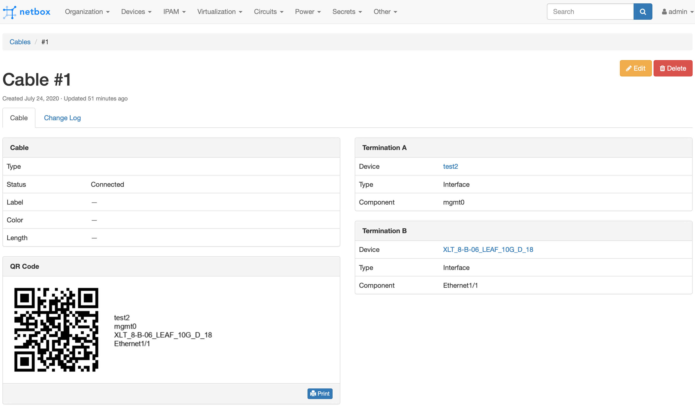

# Netbox QR Code Plugin

[Netbox](https://github.com/netbox-community/netbox) plugin for generate QR codes for objects: Rack, Device, Cable.

This plugin depends on [qrcode](https://github.com/lincolnloop/python-qrcode) and [Pillow](https://github.com/python-pillow/Pillow) python library

## Compatibility

This plugin in compatible with [NetBox](https://netbox.readthedocs.org/) 2.8 and later.

## Installation

The plugin is available as a Python package in pypi and can be installed with pip

```
pip install netbox-qrcode
```
Enable the plugin in /opt/netbox/netbox/netbox/configuration.py:
```
PLUGINS = ['netbox_qrcode']
```
Restart NetBox and add `netbox-qrcode` to your local_requirements.txt

## Configuration

The following options are available:

* `with_text`: Boolean (default True). Text label will be added to QR code image if enabled.
* `text_fields`: List of String (default ['name']). Text fields of an object that will be added as text label to QR image. It's possible to use custom field values.
* `font`: String (default TahomaBold) Font name for text label ( Some font include in package, see fonts dir).
* `text_location`: Where to render the text, relative to the QR code.  Valid values are `"right"` (default), `"left"`", `"up"`, and `"down"`.
* `custom_text`: String or None (default None) additional text label to QR code image (will be added after text_fields).
* `qr_version`: Integer (default 1) parameter is an integer from 1 to 40 that controls the size of
the QR Code (the smallest, version 1, is a 21x21 matrix).
* `qr_error_correction`: Integer (default 0),  controls the error correction used for the
QR Code. The following values are available:

   1 - About 7% or less errors can be corrected.
   0 - About 15% or less errors can be corrected.
   2 - About 30% or less errors can be corrected.
   3 - About 25% or less errors can be corrected.

* `qr_box_size`: Integer (default 6),  controls how many pixels each "box" of the QR code
is.
* `qr_border`: Integer (default 4),  controls how many boxes thick the border should be
(the default is 4, which is the minimum according to the specs).

### Per object options

Per object options override default options. Per object options dictionary can contains any of default options inside.

* `device`: Dict or None (default {'text_fields': ['name', 'serial']}), set None to disble QR code
* `rack`: Dict or None (default {'text_fields': ['name']}) , set None to disble QR code
* `cable`: Dict or None ( defaul {'text_fields': ['_termination_a_device', 'termination_a', '_termination_b_device', 'termination_b',]}), set None to disble QR code

Configuration example:
```
PLUGINS_CONFIG = {
    'netbox_qrcode': {
        'with_text': True,
        'text_fields': ['name', 'serial'],
        'font': 'ArialMT',
        'font_size': 12, # If the value is 0 or the line does not exist, then the text is automatically adjusted
        'custom_text': 'Property of SomeCompany\ntel.8.800333554-CALL',
        'text_location': 'up',
        'qr_version': 1,
        'qr_error_correction': 0,
        'qr_box_size': 4,
        'qr_border': 4,
        # per object options
        'cable': None,  # disable QR code for Cable object
        'rack': {
            'text_fields': [
                'site',
                'name',
                'facility_id',
                'tenant',
                'cf.cf_name'
            ]
        },
        'device': {
            'qr_box_size': 6,
            'custom_text': None,
        }
    }
}
```

## Contributing
Developing tools for this project based on [ntc-netbox-plugin-onboarding](https://github.com/networktocode/ntc-netbox-plugin-onboarding) repo.

Issues and pull requests are welcomed.

## Screenshots

Device QR code with text label


Rack QR code


Cable QR code

