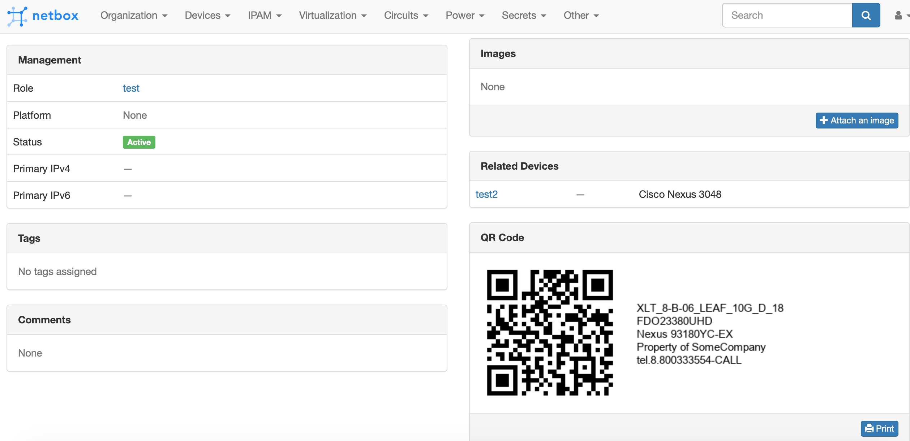

# NetBox QR Code

This [NetBox](http://netboxlabs.com/oss/netbox/) plugin generates printable QR code labels for objects in NetBox. Labels are rendered directly on an object's detail view, and each object type can carry several independent label designs — different sizes, different content, or different layouts for the same device.

Supported object types are Device, Module, Rack, Cable, Location, Power Feed, and Power Panel, plus Asset when [netbox-inventory](https://github.com/ArnesSI/netbox-inventory) is installed.

See the [compatibility matrix](COMPATIBILITY.md) for supported NetBox versions.

[](https://pepy.tech/project/netbox-qrcode)
[](https://pepy.tech/project/netbox-qrcode)
[](https://pepy.tech/project/netbox-qrcode)



## Installation

Brief installation instructions are provided below. For a complete installation guide, please refer to the included [documentation](docs/installation.md).

1. Activate the NetBox virtual environment:

```
$ source /opt/netbox/venv/bin/activate
```

2. Install the plugin from [PyPI](https://pypi.org/project/netbox-qrcode/):

```
$ pip install netbox-qrcode
```

3. Add `netbox_qrcode` to `PLUGINS` in `configuration.py`:

```python
PLUGINS = [
    # ...
    'netbox_qrcode',
]
```

4. Add `netbox-qrcode` to `local_requirements.txt` so the plugin survives future upgrades, then restart NetBox:

```
$ sudo systemctl restart netbox netbox-rq
```

This plugin requires no database migrations.

## Documentation

* [Introduction](docs/index.md) — what the plugin does and how labels are assembled
* [Installation](docs/installation.md) — full installation guide
* [Configuration](docs/configuration.md) — reference for every configuration parameter
* [Label Examples](docs/label-examples.md) — worked label designs you can copy
* [Printing](docs/printing.md) — printer and browser settings for accurate output
* [Change Log](docs/changelog.md)

## Contributing

Issues and pull requests are welcomed. Please note that pull requests are accepted only for approved issues.
