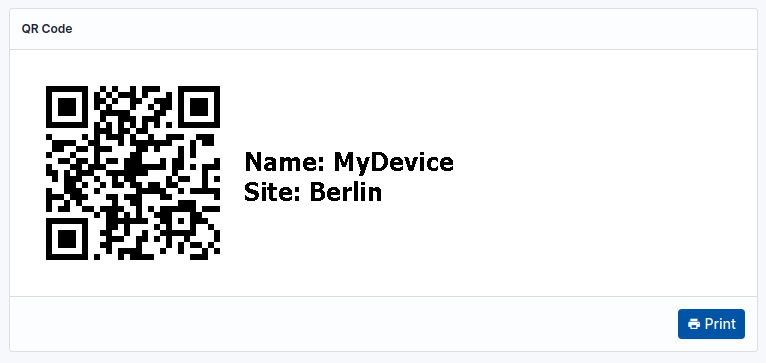
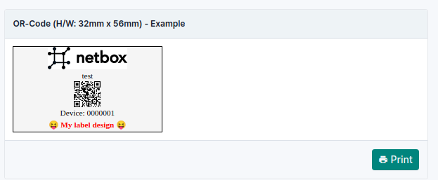

# Configuration Parameters

This page documents the configuration parameters for the NetBox QR Code plugin. They are set under the `netbox_qrcode` key of NetBox's `PLUGINS_CONFIG` dictionary in `configuration.py`, which is normally located at `/opt/netbox/netbox/netbox/configuration.py`:

```python
PLUGINS_CONFIG = {
    'netbox_qrcode': {
        'label_width': '56mm',
        'label_height': '32mm',
        'font_size': '3mm',
    },
}
```

Every parameter is optional. The plugin ships with working defaults, so an empty configuration produces usable labels.

## Resolution Order

Parameters are resolved in three layers, each overriding the one before it:

1. The plugin's built-in defaults.
2. Global parameters set directly under `netbox_qrcode`, which apply to every object type. See [Global Configuration](#global-configuration).
3. The [module-dependent block](#module-dependent-configuration) for the object type being viewed, for example `device`, which applies to that object type only.

Dimensions may be given in any CSS length unit; millimetres (`mm`) and inches (`in`) are the practical choices for physical labels.

---

## General

### `title`

Default: `''` (empty)

A title displayed in the label panel heading. Useful for distinguishing between several label designs for the same object type.

```python
'title': '',                                        # DEFAULT
'title': 'My text extension in the plugin heading.',
```

---

## Text Content

### `with_text`

Default: `True`

Whether a text label is rendered alongside the QR code.

```python
'with_text': True,   # DEFAULT
'with_text': False,
```

### `text_location`

Default: `'right'`

Where the text is rendered, relative to the QR code.

```python
'text_location': 'right',  # DEFAULT
'text_location': 'left',
'text_location': 'up',
'text_location': 'down',
```

### `text_align_horizontal`

Default: `'left'`

Where the text is positioned horizontally within the text area.

```python
'text_align_horizontal': 'left',    # DEFAULT
'text_align_horizontal': 'center',
'text_align_horizontal': 'right',
```

### `text_align_vertical`

Default: `'middle'`

Where the text is positioned vertically within the text area.

```python
'text_align_vertical': 'middle',  # DEFAULT
'text_align_vertical': 'top',
'text_align_vertical': 'bottom',
```

---

## Text Source

There are two mutually exclusive ways to produce the label text. Option A composes the text from a list of field names. Option B hands full control to a template.

!!! note
    Setting [`text_template`](#text_template) causes both [`text_fields`](#text_fields) and [`custom_text`](#custom_text) to be ignored.

### Option A: Field List

#### `text_fields`

Default: `['name', 'serial']`

A list of field names read from the object and rendered as the label text, one per line. Custom field values may also be used.

```python
'text_fields': ['name', 'serial'],  # DEFAULT
'text_fields': ['name'],
'text_fields': ['site',
                'name',
                'id'],
```

Fields which do not exist on the object are skipped silently, so a single list can be shared across object types. Multi-value fields, such as cable terminations, are rendered as a comma-separated list of their values.

Dotted notation reads a key from a dictionary-valued field, such as custom field data, or an attribute of the first element of a multi-value field:

```python
'text_fields': ['custom_field_data.rack_unit'],  # key of a custom field
'text_fields': ['a_terminations.device'],        # attribute of the first termination
```

!!! note
    Dotted notation does not traverse a plain foreign key. `'site.name'` contributes nothing, because the lookup is performed as a dictionary access. Listing the field undotted (`'site'`) renders the related object's string representation, and [`text_template`](#text_template) can reach any related attribute — for example `{{ obj.site.name }}`.

#### `custom_text`

Default: `None`

Additional fixed text appended after the fields listed in `text_fields`.

```python
'custom_text': None,       # DEFAULT
'custom_text': 'My Text',
```

### Option B: Template

#### `text_template`

Default: `None`

A [Django template](https://docs.djangoproject.com/en/stable/ref/templates/language/) string used to author the label text freely. HTML is permitted, which is what makes fully hand-designed labels possible.

Three variables are available:

`{{ obj }}`
: The object being labelled (device, rack, cable, and so on). Which attributes are available depends on the object type. A useful way to discover field names is the bulk import form for that type, for example `https://server/dcim/devices/import/`, whose "Field Options" list gives names such as `status` — available here as `{{ obj.status }}`.

`{{ logo }}`
: The value stored in the [`logo`](#logo) parameter.

`{{ qrCode }}`
: The QR code image, as a Base64-encoded PNG string.

Example rendering the name and site on two lines with captions:

```python
'text_template': 'Name: {{ obj.name }}\nSite: {{ obj.site }}',
```



Embedding the logo:

```python
'text_template': '<div style="display: inline-block; height: 5mm; width: 15mm"></div>',
```

Embedding the QR code, which allows it to be placed anywhere within a hand-designed label:

```python
'text_template': '<div style="display: inline-block; height: 10mm; width: 10mm"></div>',
```

---

## Font

### `font`

Default: `'TahomaBold'`

Font family for the label text. Any font available to the browser may be used. [Web-safe fonts](https://www.w3schools.com/cssref/css_websafe_fonts.php) are recommended, as these are supported on all common systems without additional installation.

```python
'font': 'TahomaBold',        # DEFAULT
'font': 'Arial',
'font': 'Verdana',
'font': 'Arial, Verdana',    # Fall back to Verdana if Arial is unavailable
'font': '\'Trebuchet MS\'',  # Quote font names containing spaces
```

!!! note
    Fonts are resolved by the browser at render time; the plugin does not bundle font files. A font named here must be installed on the machine doing the printing, or the browser will substitute another.

### `font_size`

Default: `'3mm'`

Height of the font.

```python
'font_size': '3mm',     # DEFAULT
'font_size': '0.11in',  # For inches
```

### `font_weight`

Default: `'normal'`

Weight (density) of the font.

```python
'font_weight': 'normal',   # DEFAULT
'font_weight': 'bold',
'font_weight': 'lighter',
'font_weight': 'bolder',
```

### `font_color`

Default: `'black'`

Colour of the font. See [HTML colours](https://www.w3schools.com/html/html_colors.asp) for the accepted formats.

```python
'font_color': 'black',            # DEFAULT
'font_color': 'red',
'font_color': 'rgb(255, 0, 0)',
'font_color': '#6a5acd',
```

---

## QR Code

### `with_qr`

Default: `True`

Whether a QR code is rendered on the label.

```python
'with_qr': True,   # DEFAULT
'with_qr': False,
```

### `url_template`

Default: `None`

By default the QR code encodes the absolute URL of the object. This parameter replaces that with a [Django template](https://docs.djangoproject.com/en/stable/ref/templates/language/) string, with `{{ obj }}` as context, allowing the QR code to carry any content.

```python
'url_template': None,  # DEFAULT
'url_template': '{{ obj.name }} - Object ID: {{ obj.id }}',
```

### QR Code Image

The following parameters control generation of the QR code image itself, and correspond to the arguments of the [qrcode](https://pypi.org/project/qrcode/) library.

#### `qr_version`

Default: `1`

An integer from 1 to 40 controlling the size of the QR code matrix. Version 1 is a 21x21 matrix.

In practice, the higher the number, the more the QR code appears to contain repeated patterns. Version 1 is recommended unless you have a reason to change it.

```python
'qr_version': 1,  # DEFAULT
```

#### `qr_error_correction`

Default: `0`

Controls the error correction level, which determines how much of the printed code can be damaged or obscured while remaining readable.

```python
'qr_error_correction': 0,  # DEFAULT - about 15% or less can be corrected
'qr_error_correction': 1,  # about 7% or less can be corrected
'qr_error_correction': 2,  # about 30% or less can be corrected
'qr_error_correction': 3,  # about 25% or less can be corrected
```

#### `qr_box_size`

Default: `4`

How many pixels wide each module ("black box") of the QR code is.

Larger values produce a larger image, which takes longer to generate. If the value is too small, the QR code may appear pixelated when [`label_qr_width`](#label_qr_width) and [`label_qr_height`](#label_qr_height) scale it up.

```python
'qr_box_size': 4,  # DEFAULT
```

#### `qr_border`

Default: `0`

Width of the quiet zone rendered around the QR code image, in modules.

A value of `0` is recommended here, because the displayed size of the code is controlled more precisely by [`label_qr_width`](#label_qr_width) and [`label_qr_height`](#label_qr_height), and centred positioning already produces a margin. Note, however, that a QR code should still have some clear space around it on the finished label.

```python
'qr_border': 0,  # DEFAULT
```

#### Image Size Reference

The table below shows how combinations of the `qr_*` parameters affect the size of the generated image file. Column 4 corresponds to the defaults, and already yields an image around 4cm square.

|                     |        |        |        |        |        |        |        |        |        |        |
| ------------------- | ------ | ------ | ------ | ------ | ------ | ------ | ------ | ------ | ------ | ------ |
| qr_version          | 1      | 1      | 1      | 1      | 1      | 1      | 2      | 4      | 6      | 40     |
| qr_box_size         | 1      | 2      | 3      | 4      | 5      | 6      | 6      | 6      | 6      | 1      |
| qr_error_correction | 0      | 0      | 0      | 0      | 0      | 0      | 0      | 0      | 0      | 0      |
| qr_border           | 0      | 0      | 0      | 0      | 0      | 0      | 0      | 0      | 0      | 0      |
| DPI                 | 72     | 72     | 72     | 72     | 72     | 72     | 72     | 72     | 72     | 72     |
| cm (H/W)            | `1,02` | `2,05` | `3,07` | `4,09` | `5,12` | `6,14` | `6,14` | `6,99` | `8,68` | `6,24` |
| Pixel (H/W)         | `29`   | `58`   | `87`   | `116`  | `145`  | `174`  | `174`  | `198`  | `246`  | `177`  |

---

## Label Layout

### Label Dimensions

#### `label_width`

Default: `'56mm'`

Width of the physical label.

```python
'label_width': '56mm',   # DEFAULT
'label_width': '2.20in', # For inches
```

#### `label_height`

Default: `'32mm'`

Height of the physical label.

```python
'label_height': '32mm',   # DEFAULT
'label_height': '1.26in', # For inches
```

### Label Edge

These parameters set the margin between the label's edge and its content.

#### `label_edge_top`

Default: `'0mm'`

```python
'label_edge_top': '0mm',  # DEFAULT
'label_edge_top': '0in',  # For inches
```

#### `label_edge_left`

Default: `'1.5mm'`

```python
'label_edge_left': '1.5mm',  # DEFAULT
'label_edge_left': '0.59in', # For inches
```

#### `label_edge_right`

Default: `'1.5mm'`

```python
'label_edge_right': '1.5mm',  # DEFAULT
'label_edge_right': '0.59in', # For inches
```

#### `label_edge_bottom`

Default: `'0mm'`

```python
'label_edge_bottom': '0mm',  # DEFAULT
'label_edge_bottom': '0in',  # For inches
```

### QR Code Positioning

#### `label_qr_width`

Default: `'12mm'`

How wide the QR code image is displayed on the label.

```python
'label_qr_width': '12mm',   # DEFAULT
'label_qr_width': '0.47in', # For inches
```

#### `label_qr_height`

Default: `'12mm'`

How high the QR code image is displayed on the label.

```python
'label_qr_height': '12mm',   # DEFAULT
'label_qr_height': '0.47in', # For inches
```

#### `label_qr_text_distance`

Default: `'1mm'`

The gap between the QR code and the text.

```python
'label_qr_text_distance': '1mm',    # DEFAULT
'label_qr_text_distance': '0.039in', # For inches
```

---

## Logo / Image

### `logo`

Default: `''` (empty)

Makes a logo or image available to [`text_template`](#text_template) as `{{ logo }}`. The parameter itself only stores the image; it is placed on the label by referencing it from the template.

#### Image File Size

Keep the image as small as necessary. An image of 1920x1200px and 30MB is wasteful if it will be rendered at 10x30mm — and the larger the image, the longer the Base64 string. Where possible use pure black rather than grey or colour, which reduces the size further and is sufficient for thermal transfer printers.

Two helpful online tools:

* Resize an image in millimetres: [image.pi7.org](https://image.pi7.org/resize-image-in-mm)
* Compress an image, for example 100kB to 2kB: [tinypng.com](https://tinypng.com/)

#### Version 1: Link to the Image (simpler)

Store a path or URL to the image:

```python
'logo': '/media/image-attachments/Netbox_Icon_Example.png',
```

Then embed it in the label text. The example below is an HTML block containing the image `{{ logo }}`, the object name `{{ obj.name }}`, and the object ID `{{ obj.id }}` on three lines:

```python
'text_template': '<div style="display: inline-block; height: 5mm; width: 15mm"></div><br>{{ obj.name }}<br>Device: {{ obj.id }}<br>',
```

!!! note
    The image links used in these examples are placeholders and are not predefined by the plugin, so adapt them to your environment. Links using `http://` or `https://` also work, provided the client can reach them. The NetBox media path shown is one variant that has been tested successfully on a classic NetBox installation; that path usually resolves to `/opt/netbox/netbox/media/`.

!!! tip
    A logo link can be placed directly in `text_template`, but using the `logo` parameter is recommended, as it may be incorporated into the standard layout in a future release.

#### Version 2: Embedded Base64 Image (more complex)

An image can be embedded directly, avoiding any dependency on the client being able to reach a URL. Convert the image using a tool such as [base64-image.de](https://www.base64-image.de/); the result should begin like this:

```html
data:image/png;base64,iVBORw0KGgoAAAANSUhEUgAABysAAAIDCA...
```

!!! tip
    Place the `logo` entry at the end of the plugin configuration, since the Base64 string can be very long. It is also worth placing the whole `PLUGINS_CONFIG` block at the end of `configuration.py`.

The example below is a NetBox logo (black and white, transparent background, 3.71kB, 202x57px, 71.26mm x 20.00mm):

```python
'logo': 'data:image/png;base64,iVBORw0KGgoAAAANSUhEUgAAAMoAAAA5CAMAAABAvUQtAAAC8VBMVEUAAAAaGhsWGyAYGx4QFBhVVVVtbm4BAwUUFhlMTk8GEh47OzzBwcEWGBu3vcPExskiJisFBgYcHR4FChBAREkYJzgOIDQFBgccHyEuNTw1Njhvb292hZUKCwwMDg8UFRYSFBYgISQtLzI+P0BodYTR1NYBAQINDxEaHB4lKCwiIyRFSEs/SFJpb3aFj5iBhIecnqBwcnWGiIswQ1l1gpCfpKnNzs/EyMvS1NcICQkNDg4ICQoREhMeHyAuLzAUFxsWGRwbHyRfYWRwdHl5foNmaWxydXh5foMGDx18ipmNjo+nqayNlJuqr7QAAQIMDQ4NDg8QERIcICQVFxkdIygpLC8vLzAxNjwDCA5CREdQU1ZZXF9DRUdscHVeX2BTVVZiY2RhY2V0dneJjI9dZW0fMUY8TFwwQ1d0fYextruVlpehoaFBVmzMz9GCjZo8TF0XFxcoKSsTFRgPERQrLC4aHR40NzoDCA01NTY9P0E+QUQYGh06PkM5Ojs4PUNDQ0RJTE8/QEFITFBQUlRFR0pAQ0YQFBhfYGNQUlY6Q0xJSktkaG02ODwdIit9f4JcYmmAhIc3QUtqa22mqKqUl5pncXtXY3Gmqa67vL1mcn+RmKBXZHO0u8FrfZCcnZ7M1+EKCgoTExIHCgwECQ4XHCAlJigeIyhGR0gtMTVAQkQfIylERkhOTU1QUVQ4PkQPEhZWWVwcKDQsMjgyPUhIUlw6Qkp9fn8VGBt3en6HiYstNT1jZGVtcXREUFx+hYxdYmdNUleFiIwqOkxfYWRATFmpqqtKVmIIGjBKV2V0eX4nPFOWnKNNXnGioqKampoACBy5vcCOk5lGW3CQkpUAAAMAAAA5OTkYICgAAAMIDRM1OT4pMjoGCQw0NjcnLDIfKzdmZWQNGyoaJjJVVVZZXWEAChYIEx+Bf31iYWAOFh8fLz9VZHRPWGFDRkpUVlmssLYMGip1dnaytbaTorMqMTiYqb09WXgAAAABAQIEBAQCAwT+4jRdAAAA93RSTlMA36OYtoaE8eWKDK4rtAYJyPnc1adTJv3QxLKDHPXw6ebZya06Evzu39HKqI5dUE5NTEI9JSQgHRn38/Ps2by1qKGLdG1pXVdXOTgWFA/39OXh4ODLxMK6uq+llouBfnt5c2dkXkM4MTAvLikfFg0I4tnXz83Jv7q4t7OzsLCrqaekopycnJeVkpGLiYd+bWpoX1VHR0VCPDc1MysjIRwO/vTv3NXS0cXCvby5t6ugoJyXk46Dfn19eHNvbmtmZGReWFhUUk5OSEVAPDk2LywqJyQSEQ/Vx8a4tbGuqaijnJubmZCOiIaFhYB5d3ZvaWdjVUQ8NjQqqSQgkwAABqJJREFUaN7d2nVYFFEQAPCxz7oDDBQVUEGxUBEVMcFE7O7u7u7u7u7u7u7u7u7WAf5yZ997xy7rHqff4bf6+4c3+x2wcy9mlgPUyt6vXHX4ZbAl77DKnv39wOhKI3EtC/rKhiNpAsYWioy7GfRY0iHTFgytIXK5Qc9n5BKCod1DbjvoGYecGxjaFuQ+gJ4pyG0AQyuL3ALQ4xe5Bo1tOMoagJ42HshkBKMLLojo0Rj0nHeWskiHGPgUHCvn482bn7QEh+pr62xqS5lkCz2duxw42COUfAKHSoo4RjeTgjG2suJTKinAoYoi1rOVSWIeGDOV0IM737eJJpUc4/ccDlRUE2OmktOdH1r6C+y8i+PrYosykisOTeUCorI/LBYW1lDTdxVAWdhAcJzVKGnu0FR6IRMWFFsSVCkioktstaCuyEQsAMdJjpI8Dk2lAtqv1P+TSklwnCEoaenQVGogVzSupGjm8PDKt+OqFF2KXBu79vPkA8faQRT+J0pOPJYWFLKhZIaI0lBURhrMnrzv0GzQ8Jq8b/8MRWEWP0p1RbSQjfi2j4jQdGDlwu3ouzquqFKlynjwTUWvDL/7AxSKZ0D5ak1fFu8xmUzyUWLykUYtRCotYVcqJIXrg9Kc4SYk6e6UBsacrYDJ5OnSngUZPE2mTPQtTZAMjWxc4kFU0+RHx15gSyJ6yZsQyppk+grCzPRoNRLIc1Q6yRdYphx1UEjfGqzGYqTe7UGWRI4yAKlNw0Bv+ThuuHGcn+3GZUEhxMFgO5UEiJjaHYXFC4E5TpE6l9eqS81FKosUF53zAVcblTwDQDZVjiZIo6byiF6u7cESglZhxMZ2pEIC+dP/W+X7ly3HjByD5FEuAHihSSWNCFwr8nmtCsxQXggqLlJfD+YZ5EfSFOxOJRatO3tSWXPOu9wR+W5ugkxeXdMi30kX2qJeXiE1Kdgf4uXl1SEylfSl05aff8BDHpdgq1MeFyzhXz5tTrbjgoHpJi849iUbOD6VlUA+0rCiRd5mNHwJzA4KzirebX7SiVT6sGChfM+ZgfSgoU+AOPWINwvaO1OQRT49IAZS+c4C+i3h88VK9wAhnB+VokSesdYV1R15V6RwjjTKq94InZWFOhcKrWMglUI8oPcq7CKNqtItbtuaXTY6kxQN0FR7MSu7QdhE4UTqyGmwHmRiiycXUV1kdkEMpNKVB2solZRUbQpiVE66jctpEJpROFoavKPBQRAuh/EfIN4xshZiIpVkPLglUrmm7YuS6abSEoRTFD6UBttpcASEK65SmEpESTzZWREQk6nUss7KEjpgUWmpbip+2llpzFaa4E9hdRFlFvU0JlPpKVIBH/pV+ZNw7S8lSTJPd9vvAKGOaF5LqVfQbgqHaGpn3b8xKzCIKrcZtNajpIVq2wdaeJTPlZ9gvADOirwNCW/EJtC4QB1Wd2N8VkSJWw1Ma49nIDxQ3UJ81lOxkjHPJ7Ku9KGhOzttLXKRCVuo6CKKQ2+5FwgArb4OnhWQy92AvNTBNo1AdJun/Pv0yrxgDmnHUiHuxVv5h9TPxPorccdkrJd/qxKd+N3L5C3fTTytZwGtYogNHZpKAD+Ch/QzoWhcSBN2vYoHppAXmEBVVPm6serr4qYHyRPkbW0sg0GjO7XAtlPJPX7nUTsXGJnljApLvgCTX9MZe3bGSIUC1IVQWG4BMkmxRYL5WM37BtWg/uZfpfKKD/ujJGsoRHGNLifgwXUKLvLgUg+0qpkfhPrK55WRNEhbB4VViqa9RGa02qR8cKirqpSzNL08WQdRdbY2+etQFssCah1rpk6degMPtqaWtAPhcL9C8kbu10z1bLksjHasz1x6l6s5Oa2Q7rp6ONWhVZNAKXRbNVea5ljDeCtqHrDMyalaH+DyV5e+u8so7aeqpFgclRFxFiN2HTFCGhb7sz9ZdJjtm/tcB4hi7gnf6XNBxf+Ur19a0Jg/3Xd6K/gNQWi/IDC0OGi/jWBoOZErMjCxUsaM6RBdMrq5uSUugtxeMDKzuM8aEJWL9ZGpBj8sy4ORpRJzYtGtKyLfwnnByCiT6s3qJZwSTYk8Wm/cITA0yiQrEL1U/hVZbWUCPv9IKh1aXbVoM9Fue+Mb5o7uleiZ2Qx6RjkjuuQEo1uOTHdzdJ+MGT2XBsh4gK4cyDgbu5ZAZWTSXY3+06QpYGgVkPumf0z/G80KFEauHOhx+0f+capU9P8V5YdMJzC4geyp0NaWHoXEtQ0YXcnulboktNieOqdKnQYbu4ME+AnhAIW2MwgdrwAAAABJRU5ErkJggg==',
```

Embed it the same way as Version 1:

```python
'text_template': '<div style="display: inline-block; height: 20.00mm; width: 71.26mm"></div><br>{{ obj.name }}<br>Device: {{ obj.id }}<br>',
```

Keeping the proportional ratio, the rendered size can be adjusted freely — for example 5.00mm x 17.86mm. Inches (`in`) may be used instead of millimetres:

```python
'text_template': '<div style="display: inline-block; height: 5.00mm; width: 17.86mm"></div><br>{{ obj.name }}<br>Device: {{ obj.id }}<br>',
```

---

## Global Configuration

Parameters set directly under `netbox_qrcode` apply to every object type at once. A [module-dependent](#module-dependent-configuration) block for a specific object type takes priority over these.

```python
PLUGINS_CONFIG = {
    'netbox_qrcode': {
        'title': 'My Text in headline',
        'font_size': '5.12mm',
    }
}
```

---

## Module-Dependent Configuration

A nested block keyed by object type overrides the defaults and the global settings for that object type only. One or more parameters may be overridden.

```python
PLUGINS_CONFIG = {
    'netbox_qrcode': {
        # Applies to all object types
        'title': 'My text for all headlines',
        'font_size': '5.12mm',

        # Applies to devices only
        'device': {
            'title': 'My text for the headline Device',
            'font_size': '10mm',
        },
    }
}
```

The supported object type keys, and their default contents, are below.

### `device`

Label customisation for `https://server/dcim/devices/`.

```python
'device': {
    'text_fields': ['name', 'serial']  # DEFAULT
},
```

### `module`

Label customisation for `https://server/dcim/modules/`.

```python
'module': {
},  # DEFAULT (inherits global text_fields)
```

### `rack`

Label customisation for `https://server/dcim/racks/`.

```python
'rack': {
    'text_fields': ['name']  # DEFAULT
},
```

### `cable`

Label customisation for `https://server/dcim/cables/`.

```python
'cable': {
    'text_fields': [
        'a_terminations.device',
        'a_terminations',
        'b_terminations.device',
        'b_terminations'
        ]  # DEFAULT
},
```

The dotted entries render the device at each end of the cable; the bare entries render the terminations themselves. Cables with multiple terminations per end render them comma-separated.

### `location`

Label customisation for `https://server/dcim/locations/`.

```python
'location': {
    'text_fields': ['name']  # DEFAULT
},
```

### `powerfeed`

Label customisation for `https://server/dcim/power-feeds/`.

```python
'powerfeed': {
    'text_fields': ['name']  # DEFAULT
},
```

### `powerpanel`

Label customisation for `https://server/dcim/power-panels/`.

```python
'powerpanel': {
    'text_fields': ['name']  # DEFAULT
},
```

### `asset`

Label customisation for netbox-inventory assets, at `https://server/plugins/inventory/assets/`. This block applies only when [netbox-inventory](https://github.com/ArnesSI/netbox-inventory) is installed; otherwise it is ignored.

```python
'asset': {
    'text_fields': [
        'name',
        'asset_tag',
        'serial']  # DEFAULT
},
```

### Additional Label Designs

Several label designs can be stored for one object type — for different label sizes, or different information. Append an increment from `2` upwards to the object type key:

```python
'device_2': {
    'title': 'My Little Label',

    'label_width': '25mm',
    'label_height': '10mm',

    'font_size': '2mm',
    'font_weight': 'bold',

    'label_qr_width': '7.00mm',
    'label_qr_height': '9.00mm',
    'label_qr_text_distance': '0.4mm',

    'label_edge_left': '0.50mm',
    'label_edge_right': '0.00mm',

    'text_fields': ['name'],
},
'device_3': {
    # ...
},
'rack_2': {
    # ...
},
```

Up to ten designs per object type are supported (the base key plus `_2` through `_10`).

!!! warning
    Numbers must not be skipped. The plugin stops at the first missing increment, so in the sequence `device`, `device_2`, `device_3`, `device_5`, the design `device_5` is never rendered because `device_4` is absent.

---

## Complete Example

A configuration showing the full set of parameters. You do not need to specify all of them — every parameter has a working default.

```python
PLUGINS_CONFIG = {
    'netbox_qrcode': {
        ##################################
        # General Plugin
        'title': '',

        ##################################
        # Text content
        'with_text': True,
        'text_location': 'right',
        'text_align_horizontal': 'left',
        'text_align_vertical': 'middle',

        # Text source (Option A)
        'text_fields': ['name', 'serial'],
        'custom_text': None,

        # Text source (Option B)
        'text_template': None,

        ##################################
        # Font
        'font': 'TahomaBold',
        'font_size': '3mm',
        'font_weight': 'normal',
        'font_color': 'black',

        ##################################
        # QR-Code
        'with_qr': True,

        # QR-Code alternative source
        'url_template': None,

        # QR-Code Image File
        'qr_version': 1,
        'qr_error_correction': 0,
        'qr_box_size': 4,
        'qr_border': 0,

        ##################################
        # Label Layout

        # QR code dimensions
        'label_qr_width': '12mm',
        'label_qr_height': '12mm',

        # Label edge
        'label_edge_top': '0mm',
        'label_edge_left': '1.5mm',
        'label_edge_right': '1.5mm',
        'label_edge_bottom': '0mm',

        # Label dimensions and QR code positioning
        'label_width': '56mm',
        'label_height': '32mm',
        'label_qr_text_distance': '1mm',

        ##################################
        # Module-dependent configuration

        'device': {
            'text_fields': ['name', 'serial']
        },

        'device_2': {
            'title': 'My Little Label',

            'label_width': '25mm',
            'label_height': '10mm',

            'font_size': '2mm',
            'font_weight': 'bold',

            'label_qr_width': '7.00mm',
            'label_qr_height': '9.00mm',
            'label_qr_text_distance': '0.4mm',

            'label_edge_left': '0.50mm',
            'label_edge_right': '0.00mm',

            'text_fields': ['name'],
        },

        'module': {
        },

        'rack': {
            'text_fields': ['name']
        },

        'cable': {
            'text_fields': [
                'a_terminations.device',
                'a_terminations',
                'b_terminations.device',
                'b_terminations'
                ]
        },

        'location': {
            'text_fields': ['name']
        },

        'powerfeed': {
            'text_fields': ['name']
        },

        'powerpanel': {
            'text_fields': ['name']
        },

        'asset': {
            'text_fields': [
                'name',
                'asset_tag',
                'serial']
        },

        'logo': ''
    }
}
```

## Next Steps

See [Label Examples](label-examples.md) for complete, illustrated label designs you can copy.


