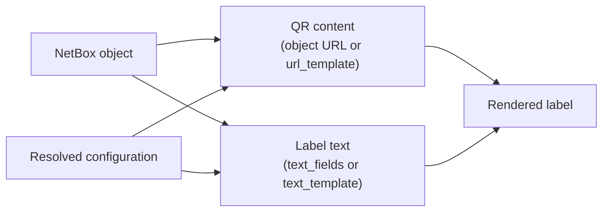

# NetBox QR Code

[NetBox](https://github.com/netbox-community/netbox) is the world's leading source of truth for network infrastructure. Once that inventory exists, a recurring practical problem follows: physically labelling the equipment it describes, so that a technician standing in front of a rack can get back to the right NetBox record.

This plugin closes that loop. It renders printable QR code labels directly on NetBox object detail views. Each label encodes a link back to the object (or any content you choose), alongside text drawn from the object's own fields.

Labels are defined entirely in configuration — there are no models, no migrations, and no database changes. Because layout is expressed as HTML and CSS and rendered by the browser, label design is limited mainly by what your printer can reproduce.

## Features

* QR code labels are rendered on the detail views of Device, Module, Rack, Cable, Location, Power Feed, and Power Panel objects, plus Asset when [netbox-inventory](https://github.com/ArnesSI/netbox-inventory) is installed.

* Each object type can define up to ten independent label designs, so a device can carry both a full-size asset label and a small port label.

* Label text can be assembled from a list of object fields, or authored freely as a template with full access to the object.

* Physical dimensions, margins, fonts, colours, and QR code placement are all configurable, in millimetres or inches.

* Logos and images can be embedded, either by link or as inline Base64 data.

* QR code content defaults to the object's absolute URL, but can be replaced with any templated value.

* No external dependencies beyond a supported version of NetBox and the [qrcode](https://github.com/lincolnloop/python-qrcode) and [Pillow](https://github.com/python-pillow/Pillow) Python libraries, which are installed automatically. No migrations are required.

## Terminology

* A **label** is a single rendered panel on an object's detail view, containing a QR code, text, or both.

* A **label design** is the set of configuration parameters that produce one label. Each object type has a default design, and may define additional numbered designs.

* The **object** is the NetBox record being labelled — a device, rack, cable, and so on. It is exposed to templates as `obj`.

* A **module-dependent configuration** is a block of parameters that applies to one object type only, overriding the global defaults. These are keyed by object type, for example `device` or `rack`.

## How a Label Is Assembled

Configuration is resolved in three layers, each overriding the one before it:

1. The plugin's built-in defaults.
2. Any global parameters you set under `netbox_qrcode` in `PLUGINS_CONFIG`.
3. The module-dependent block for the object type being viewed, for example `device`.

Within a layer, the QR code and the text are produced independently and then composed:



The QR code content is the object's absolute URL unless [`url_template`](configuration.md#url_template) overrides it. The text is built from [`text_fields`](configuration.md#text_fields) unless [`text_template`](configuration.md#text_template) overrides it — the two text sources are mutually exclusive.

!!! tip
    Start from a [worked example](label-examples.md) rather than from an empty configuration. The examples cover the common layouts — text only, QR only, vertical cable labels, and fully hand-designed labels — and are quicker to adapt than assembling parameters from scratch.

## Multiple Label Designs

To add a second design for an object type, append `_2` to the object type key, then `_3`, and so on up to `_10`:

```python
PLUGINS_CONFIG = {
    'netbox_qrcode': {
        'device': {
            'text_fields': ['name', 'serial'],
        },
        'device_2': {
            'title': 'Small label',
            'label_width': '25mm',
            'label_height': '10mm',
        },
    }
}
```

Each design renders as an additional panel on the object's detail view.

!!! warning
    The numbering must be contiguous. The plugin stops looking at the first missing number, so defining `device_2` and `device_4` without `device_3` means `device_4` is never rendered.

## Getting Started

Continue to the [installation guide](installation.md), then work through the [configuration reference](configuration.md).
