# Label Examples

Complete label designs you can copy into `PLUGINS_CONFIG` and adapt. Each example shows the rendered result followed by the configuration that produces it.

The examples are written as additional label designs (`device_2`, `cable_2`, and so on) so they can be pasted alongside an existing configuration without replacing it. See [Additional Label Designs](configuration.md#additional-label-designs) for how the numbering works.

!!! note
    Several examples reference `/media/image-attachments/Netbox_Icon_Example.png`. This is a placeholder path, not something the plugin provides — see [Version 1: Link to the Image](configuration.md#version-1-link-to-the-image-simpler) for how to supply your own.

## Device Labels

### Example 1 — Default

The standard label, with no customisation at all.

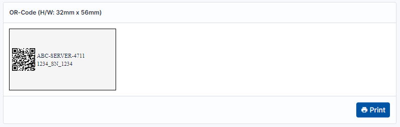

### Example 2 — Logo, with a zero-padded device ID

QR code taller than it is wide, with a logo, the device name, and the device ID padded with zeros.

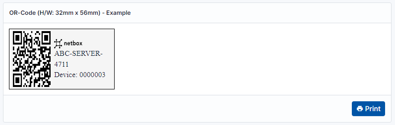

```python
'device_2': {
    'title': 'Example 2 (Template for Device)',
    'text_template': '<div style="display: inline-block; height: 5mm; width: 15mm"></div><br>{{ obj.name }}<br>Device: {{ obj.id|stringformat:"07d" }}',
    'font_size': '4mm',
    'label_qr_width': '20mm',
    'label_qr_height': '30mm',
    'label_qr_text_distance': '2mm',
    'label_width': '56mm',
    'label_height': '32mm',
    'label_edge_top': '0mm',
    'label_edge_left': '2mm',
    'label_edge_right': '2mm',
    'logo': '/media/image-attachments/Netbox_Icon_Example.png',
},
```

### Example 3 — Text left, QR code right

Text on the left and the QR code on the right, with a margin at the edges.

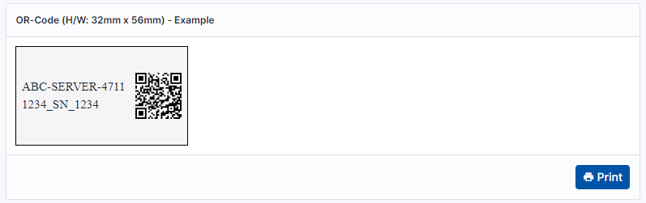

```python
'device_2': {
    'title': 'Example 3 (Template for Device)',
    'font_size': '4mm',
    'label_qr_width': '15mm',
    'label_qr_height': '15mm',
    'label_qr_text_distance': '2mm',
    'label_width': '56mm',
    'label_height': '32mm',
    'label_edge_top': '0mm',
    'label_edge_left': '2mm',
    'label_edge_right': '2mm',
    'text_location': 'left',
},
```

### Example 4 — Centred text only

No QR code; text centred both horizontally and vertically.

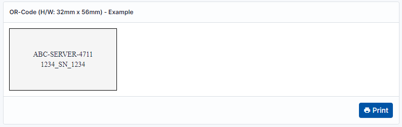

```python
'device_2': {
    'title': 'Example 4 (Template for Device)',
    'font_size': '4mm',
    'text_align_horizontal': 'center',
    'text_align_vertical': 'middle',
    'label_qr_width': '20mm',
    'label_qr_height': '20mm',
    'label_qr_text_distance': '0mm',
    'label_width': '56mm',
    'label_height': '32mm',
    'label_edge_top': '0mm',
    'label_edge_left': '0mm',
    'label_edge_right': '0mm',
    'with_text': True,
    'with_qr': False,
},
```

### Example 5 — Left-aligned text only

As Example 4, but with the text aligned left.

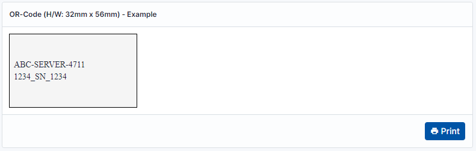

```python
'device_2': {
    'title': 'Example 5 (Template for Device)',
    'font_size': '4mm',
    'text_align_horizontal': 'left',
    'text_align_vertical': 'middle',
    'label_qr_width': '20mm',
    'label_qr_height': '20mm',
    'label_qr_text_distance': '0mm',
    'label_width': '56mm',
    'label_height': '32mm',
    'label_edge_top': '0mm',
    'label_edge_left': '2mm',
    'label_edge_right': '0mm',
    'with_text': True,
    'with_qr': False,
},
```

### Example 6 — QR code only

No text at all.

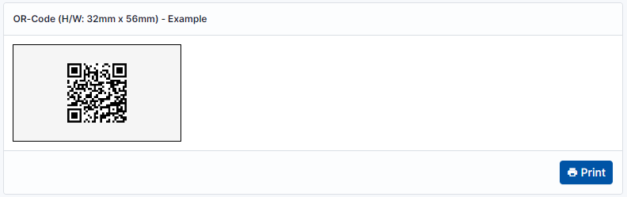

```python
'device_2': {
    'title': 'Example 6 (Template for Device)',
    'font_size': '4mm',
    'label_qr_width': '20mm',
    'label_qr_height': '20mm',
    'label_qr_text_distance': '0mm',
    'label_width': '56mm',
    'label_height': '32mm',
    'label_edge_top': '0mm',
    'label_edge_left': '0mm',
    'label_edge_right': '0mm',
    'with_text': False,
    'with_qr': True,
},
```

### Example 7 — Portrait, text above the QR code

Upright label, large font with a line break, including the serial number.

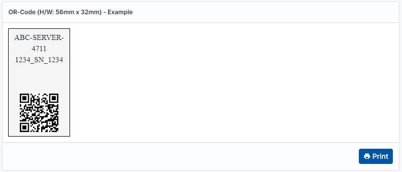

```python
'device_7': {
    'title': 'Example 7 (Template for Device)',
    'font_size': '4mm',
    'label_qr_width': '20mm',
    'label_qr_height': '20mm',
    'label_qr_text_distance': '0mm',
    'label_width': '32mm',
    'label_height': '56mm',
    'label_edge_top': '2mm',
    'label_edge_left': '0mm',
    'label_edge_right': '0mm',
    'text_location': 'up',
    'text_align_horizontal': 'center',
    'text_align_vertical': 'top',
    'label_edge_bottom': '2mm',
},
```

### Example 8 — Portrait, text below the QR code

As Example 7, but with the text below the QR code.

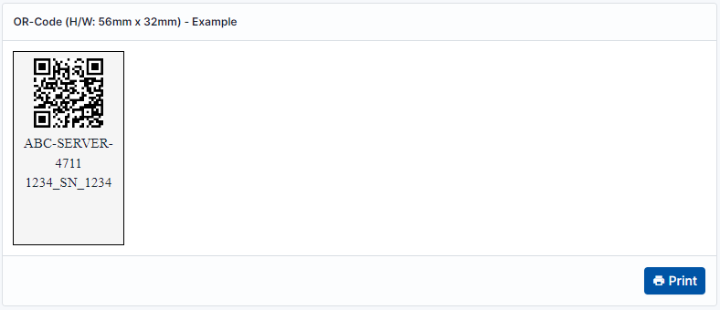

```python
'device_8': {
    'title': 'Example 8 (Template for Device)',
    'font_size': '4mm',
    'label_qr_width': '20mm',
    'label_qr_height': '20mm',
    'label_qr_text_distance': '2mm',
    'label_width': '32mm',
    'label_height': '56mm',
    'label_edge_top': '2mm',
    'label_edge_left': '0mm',
    'label_edge_right': '0mm',
    'text_location': 'down',
    'text_align_horizontal': 'center',
    'text_align_vertical': 'top',
},
```

### Example 9 — Small label

A 25mm x 10mm label, for cases where space is tight.

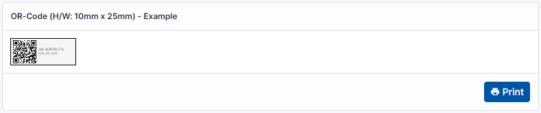

```python
'device_9': {
    'title': 'Example 9 (Template for Device)',
    'font_size': '1mm',
    'label_qr_width': '9mm',
    'label_qr_height': '9mm',
    'label_qr_text_distance': '1mm',
    'label_width': '25mm',
    'label_height': '10mm',
    'label_edge_top': '0.2mm',
    'label_edge_left': '0.2mm',
    'label_edge_right': '0mm',
},
```

### Example 10 — Completely self-designed

With `text_template` the label content is specified entirely by you, which opens up most layout possibilities. Note that `with_qr` is disabled here and the QR code is instead placed by hand within the template, using `{{ qrCode }}`.


Save this NetBox icon as an example in the following NetBox folder — `/opt/netbox/netbox/media/image-attachments/Netbox_Icon_Example.png`:

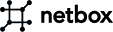

```python
'device_10': {
    'title': 'Example 10 (Template for Device)',
    'with_qr': False,
    'text_align_horizontal': 'center',
    'text_align_vertical': 'middle',
    'text_template': '<div style="display: inline-block; height: 8.65mm; width: 30mm"></div><br>'
                     '{{ obj.name }} <br>'
                     '<div style="display: inline-block; height: 10mm; width: 10mm"></div><br>'
                     'Device: {{ obj.id|stringformat:"07d" }}'
                     '<p>&#128541; <font color="red"><b> My label design </b> </font> &#128541;</p>',

    'label_width': '56mm',
    'label_height': '32mm',
    'label_edge_top': '0mm',
    'label_edge_left': '0mm',
    'label_edge_right': '0mm',
},
```

!!! note
    The screenshot above was captured before a duplicate `title` key was removed from this example, so it shows the panel heading as "Example". The configuration below now renders the heading as "Example 10 (Template for Device)".

## Cable Labels

### Example 1 — Vertical writing

Writing the text vertically, for cable labelling on a label which is wide but not tall.

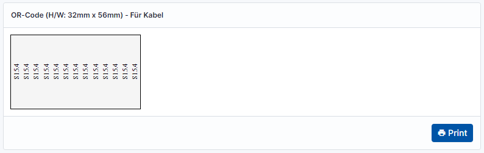

```python
'cable': {
    'title': 'Example 1 (Template for Cable)',
    'with_qr': False,
    'label_edge_left': '0.00mm',
    'label_edge_right': '0.00mm',
    'label_edge_top': '0.00mm',
    'text_align_vertical': 'middle',
    'text_align_horizontal': 'center',
    'text_template': '<span style="writing-mode: vertical-lr; transform: scale(-1);">'
                     '{{ obj.label }}</br>'
                     '{{ obj.label }}</br>'
                     '{{ obj.label }}</br>'
                     '{{ obj.label }}</br>'
                     '{{ obj.label }}</br>'
                     '{{ obj.label }}</br>'
                     '{{ obj.label }}</br>'
                     '{{ obj.label }}</br>'
                     '{{ obj.label }}</br>'
                     '{{ obj.label }}</br>'
                     '{{ obj.label }}</br>'
                     '{{ obj.label }}</br>'
                     '{{ obj.label }}</br>'
                     '</span>'
},
```

### Example 2 — Code 128 barcode

Rendering a Code 128 barcode instead of a QR code.

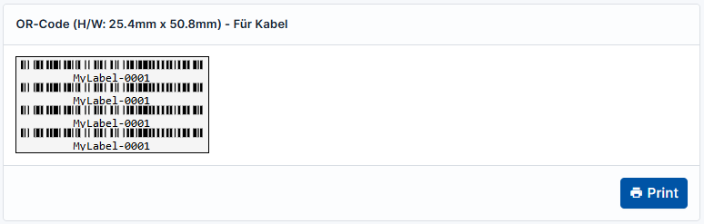

!!! warning
    This example loads JsBarcode from a public CDN, so the browser rendering the label needs internet access. The barcode is generated client-side in the browser, not on the NetBox server.

```python
'cable_2': {
    'title': 'Example 2 (Template for Cable)',
    'with_qr': False,
    'label_edge_left': '0.00mm',
    'label_edge_right': '0.00mm',
    'label_edge_top': '0.00mm',
    'text_align_vertical': 'middle',
    'text_align_horizontal': 'center',

    # QR-Code Image File
    'qr_version': 1,
    'qr_error_correction': 1,
    'qr_box_size': 2,
    'qr_border': 0,

    'text_template': '<svg id="barcode"></svg>'
                     '<svg id="barcode"></svg>'
                     '<svg id="barcode"></svg>'
                     '<svg id="barcode"></svg>'
                     ''
                     '<style>'
                     '   #barcode {'
                     '   max-width: 48mm;'
                     '   width: 100%;'
                     '   max-height: 6mm;'
                     '   height: 100%;'
                     '   }'
                     '</style>'
                     ''
                     '<script src="https://cdn.jsdelivr.net/npm/jsbarcode@3.11.0/dist/JsBarcode.all.min.js"></script>'
                     ''
                     '<script>'
                     '   JsBarcode("#barcode", "{{ obj.label }}", {'
                     '   background: "transparent",'
                     '   format: "CODE128",'
                     '   displayValue: true,'
                     '   margin: 0,'
                     '   height: 15'
                     '   });'
                     '</script>'
}
```

## Next Steps

Once a design looks right in the NetBox UI, see [Printing](printing.md) for the printer and browser settings needed to reproduce it accurately on paper.
