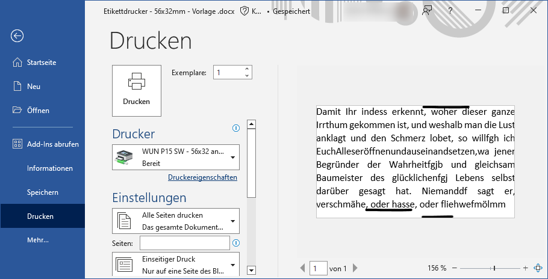
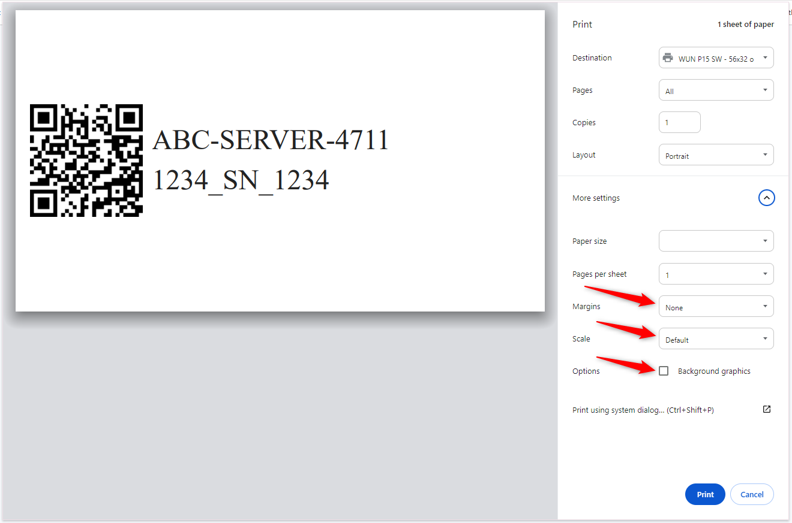

# Printing

A label that looks correct in the NetBox UI will not necessarily print correctly. Printer drivers and browsers both apply their own scaling and margins, and these need to be neutralised before the printed label matches the on-screen preview.

Press the **Print** button beneath a label panel to open the browser's print dialog for that label.

## Setting Up the Label Printer

If the print does not match the preview in NetBox, first try to get a perfect print from Word. Many printer settings influence the result, and it is easier to isolate them outside the browser. Borderless printing is possible if the printer supports it — thermal transfer printers generally do.

For a worked example of what to consider when printing borderless from a Word document, see [this Zebra ZM400 300dpi configuration for a 56x32mm label](img/Configuration_Printer_ZM400.png).

## Browser Print Settings

When you press **Print**, the browser adds print properties of its own. These interfere with the result and should be disabled.

### Firefox

| Parameter                             | Value                     |
| ------------------------------------- | ------------------------- |
| Orientation                           | Portrait                  |
| Paper size                            | User defined              |
| Margins                               | none                      |
| Scale                                 | Fit to page width or 100% |
| Options → Print headers and footers   | disable                   |
| Options → Print backgrounds           | disable                   |

### Chrome

Chrome can alter settings between the print preview and the actual print, so the settings below are recommended.

| Parameter                    | Value            |
| ---------------------------- | ---------------- |
| Layout                       | Portrait         |
| Paper size                   | empty            |
| Pages per sheet              | 1                |
| Margins                      | none             |
| Scale                        | Default or 100%  |
| Options → Background graphics | disable         |

!!! warning
    Leaving **Scale** on anything other than 100% (or "Fit to page width") is the most common cause of labels printing at the wrong physical size, since the millimetre dimensions set in the configuration are then silently rescaled by the browser.

## Troubleshooting

**The label prints at the wrong size.**
Check the browser scale setting first, then confirm the paper size configured in the printer driver matches the physical label stock. The `label_width` and `label_height` parameters describe the label, not the page.

**The QR code looks pixelated when printed.**
Raise [`qr_box_size`](configuration.md#qr_box_size) so the generated image has more pixels to scale from. The displayed size is set by [`label_qr_width`](configuration.md#label_qr_width) and [`label_qr_height`](configuration.md#label_qr_height); if these scale a small image up, it will look coarse.

**The QR code will not scan.**
Ensure there is some clear space around the code on the finished label, and consider raising [`qr_error_correction`](configuration.md#qr_error_correction) so the code tolerates damage and wear once applied.

**Text is clipped.**
The text area is bounded by the label dimensions minus the edge margins and the QR code width. Reduce [`font_size`](configuration.md#font_size), shorten the content, or increase [`label_width`](configuration.md#label_width).

**The font differs from the preview.**
Fonts are resolved by the browser, and the plugin bundles none. Use a [web-safe font](https://www.w3schools.com/cssref/css_websafe_fonts.php), or ensure the font named in [`font`](configuration.md#font) is installed on the machine doing the printing.
